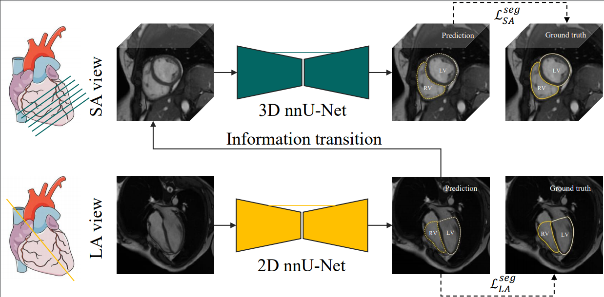

# Right Ventricular Segmentation from Short- and Long-Axis MRIs via Information Transition
This repository contains the code for the paper "Right Ventricular Segmentation from Short- and Long-Axis MRIs via Information Transition". The project is still under constructing. At present, we have released the core codes.   

# Abstract 
Right ventricular (RV) segmentation from magnetic resonance imaging (MRI) is a crucial step for cardiac morphology and function analysis.
However, automatic RV segmentation from MRI is still challenging, mainly due to the heterogeneous intensity, the complex variable shapes, and the unclear RV boundary.
Moreover, current methods for the RV segmentation tend to suffer from performance degradation at the basal and apical slices of MRI.
In this work, we propose an automatic RV segmentation framework, where the information from long-axis (LA) views is utilized to assist the segmentation of short-axis (SA) views via information transition.
Specifically, we employed the transformed segmentation from LA views as a prior information, to extract the ROI from SA views for better segmentation. 
The information transition aims to remove the surrounding ambiguous regions in the SA views.
We tested our model on a public dataset with 360 multi-center, multi-vendor and multi-disease subjects that consist of both LA and SA MRIs.
Our experimental results show that including LA views can be effective to improve the accuracy of the SA segmentation.

This framework has been applied to multi-view RV segmentation task:
[M&Ms-2](https://www.ub.edu/mnms-2/)

This is the diagram of the proposed framework:
<!--  --> 

## Overview
- [trained model file](https://drive.google.com/drive/folders/1PIJs9S2MFt6ncbNgBlOjK-pV4QU4AC9X):  
- [prediction code](./model/model.py)

## Acknowledgement
This project is largely based on the "nnUnet" and "simpleitk" repositories.

## Reference 

``

## Contact
If have any question, create a new issue, or directly email me at moon_well@live.cn
